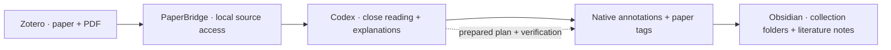

  
  <h1>PaperBridge</h1>
  
Read papers. Understand the details. Keep the evidence.

  

    
    
    
    
    
  

  
<a href="README.md">简体中文</a> | <strong>English</strong>

  
<a href="https://github.com/Antonalia/PaperBridge/releases/latest">Download</a> · <a href="#get-started">Get started</a> · <a href="#bundled-skills">Skills</a> · <a href="BUILD.en.md">Build</a>

PaperBridge connects your local Zotero personal library to Codex for source-based reading, editable native annotations, paper tags and collection-aware Obsidian notes. **Version 1.0.3** includes automatic skill installation and a Chinese/English settings interface. Chinese is the default.

| 📖 Read and explain | 🖍️ Annotate and organize |
| :--- | :--- |
| Read local PDFs, verify formulas, and explain mechanisms with worked examples. | Create native highlights, notes and image regions; add paper-level topic tags. |
| **🗂️ Keep notes in context** | **⚡ Set up once** |
| Import comments and cached images into Obsidian, following Zotero collections and link preferences. | Configure the bundled MCP companion and install skills together. Future updates add new bundled skills. |

## Get started

1. **Prepare the apps.** Use Windows x64, Zotero and Codex. An existing Obsidian vault is needed only for note imports. The PDF runtime is bundled; no Python, Node.js or C++ compiler is required. Zotero 7–11 is the declared manifest range, not a claim that every version has been tested on a real device.
2. **Install the XPI.** Download `paperbridge-1.0.3.xpi` from [Releases](https://github.com/Antonalia/PaperBridge/releases/latest). In Zotero, open **Tools → Plugins → gear → Install Add-on From File**, select the XPI and restart if prompted. The source ZIP is not needed for installation.
3. **Configure Codex and skills.** Open **PaperBridge** in Zotero settings, enable the local bridge and click **Configure Codex**. This installs the bundled companion and skills, then reports their state. **Fully quit and reopen Codex.** Keep Zotero running while using the connection. You can choose English in the language selector before setup to install English skill entrypoints.
4. **Choose a paper.** Add a regular paper item and PDF to the personal library, preferably within a collection. Ask Codex: “Find *paper title* in Zotero, read its PDF, and explain the method and results.” Group libraries are not supported. Scanned PDFs may require OCR before exact text anchoring is possible.
5. **Enable authorized writes.** Turn on **Allow native highlights, underlines, annotations and paper tags**. Ask for key annotations or paper tags. Codex prepares a plan, checks it, applies within your request and verifies the result. Native annotations do not rewrite the PDF file. Paper tags are appended to the regular parent item; existing tags and types are preserved, and new tags are automatic Zotero tags.
6. **Set the Obsidian destination.** Enter the full vault path, a vault-relative top folder, and the collection-based or flat layout. With a top folder `Literature` and a collection `Robotics`, notes go in `Literature/Robotics/`. For multiple collections, select the intended one. Configure the text, image and figure link switches as needed.
7. **Import and verify.** Ask Codex to import the annotations and expand the method, formulas, experiments and conclusions. PaperBridge previews the path and content, backs up existing notes, preserves manual text and avoids duplicate annotation blocks. Verify the folder, images and enabled source links.

To check the connection, ask “Check PaperBridge status.” Changing the interface language does not translate your saved rules, folder names, paper titles or notes. Existing folder preferences stay unchanged.

## Bundled skills

| Skill | Purpose | Example request |
| :--- | :--- | :--- |
| [`zotero-paper-annotator`](skills/zotero-paper-annotator/SKILL.en.md) | Close reading, native annotations, formula explanations, worked Markdown examples and paper tags. | `$zotero-paper-annotator Add topic tags to Ctrl-World.` |
| [`zotero-literature-notes`](skills/zotero-literature-notes/SKILL.en.md) | Verify source evidence, supplement annotations, import by Zotero collection and expand the same Obsidian note. | `$zotero-literature-notes Read this paper in depth and save it to Obsidian.` |

**No manual folder copying is needed.** Setup installs all bundled skills into `$CODEX_HOME/skills` (default `~/.codex/skills`). Every new release discovers all bundled `SKILL.md` folders, so later skills use the same installation path. Unmodified managed skills are updated. Locally edited or independently installed conflicting skills are preserved and reported; setup does not silently overwrite them. Identical copies can be adopted for subsequent managed updates. Setup records file hashes in `paperbridge-skills.json`. Restart Codex to discover changes. The Chinese and English documentation remains available in each installed folder; selecting a language before setup selects the entrypoints for that language when updates are safe.

## Automatic updates

1. Versions before 1.0.2 need one manual XPI upgrade to gain a valid update address.
2. In Zotero's plugin details, set **Allow automatic updates** to **On**. Default follows Zotero's global setting; Off disables background updates. Early versions forced this off, so existing users may need to turn it on once. PaperBridge respects your choice.
3. Use **Check for Updates** for an immediate check. Zotero downloads the matching XPI from the public GitHub release feed and verifies its SHA-256. Manual installation remains available if the network cannot reach the feed.
4. A configured, enabled, unmodified `zotero_local` connection is upgraded automatically at plugin startup, preserving other MCPs and extra settings. New bundled skills are installed, unchanged managed skills are updated and edited skills are preserved. Removed, disabled or customized connections are not recreated or overwritten. Check setup status, then restart Codex. Retry Configure Codex if setup fails.

Update requests carry ordinary network information to GitHub, not your papers, annotations or local connection token.

## Upgrading from versions with Zotero sync errors

If an older version produced `relations values currently must be Zotero item URIs`, an HTTP 400 item upload or `Made no progress during upload`, install the current XPI and restart Zotero. The unchanged plugin ID retains preferences. Startup backs up and migrates the two legacy internal URN types (`urn:codex-pdf-bridge:` and `urn:codex-zotero:content-kind:`) to local metadata, removing only the plugin's invalid relations while preserving native annotation fields and valid Zotero item relations. Reconfigure Codex if needed, restart it and verify Zotero synchronization yourself. Successful local migration does not prove a successful cloud sync.

Metadata and migration backups live in **`paperbridge/` beneath the Zotero data directory**, not the plugin directory. They may contain annotation data. Do not publish or delete them as an update workaround. Disabling an older plugin alone does not clean its invalid relations. This release retains the 1.0.1 synchronization repair.

## Troubleshooting and downloads

| Question | What to check |
| :--- | :--- |
| Setup executable will not start | Install a compatible [Microsoft Visual C++ x64 runtime](https://learn.microsoft.com/en-us/cpp/windows/latest-supported-vc-redist) if missing. The executable has no commercial code-signing certificate. |
| New tools or skills do not appear | Keep Zotero open, enable the bridge, check setup status, then fully quit and reopen Codex. |
| A skill was preserved | It differs from the last managed copy, or was installed independently. Review your changes before replacing it; PaperBridge leaves it intact. |
| A note is in the wrong folder | Check the vault, top folder, layout and full parent/child collection path. Unfiled papers go in the top folder. |
| Which download do I need? | Install the XPI. The versioned source ZIP contains complete corresponding source and dependencies. `SHA256SUMS.txt` verifies artifacts; `updates.json` is read by Zotero. GitHub's automatic source archive does not contain the separately bundled dependency sources. |

## Privacy, license and development

The authenticated `127.0.0.1` bridge runs locally. Codex's subsequent handling of paper content depends on Codex/OpenAI product settings; a local bridge does not imply a fully offline model. See [Privacy](PRIVACY.en.md).

AGPL-3.0-or-later: [License](LICENSE), [Corresponding source](SOURCE-CODE.en.md), [Third-party notices](THIRD-PARTY-NOTICES.md), [Build guide](BUILD.en.md), [Changelog](CHANGELOG.en.md). PaperBridge is an independent community project, with no affiliation or endorsement from Zotero, OpenAI or Beaver.
